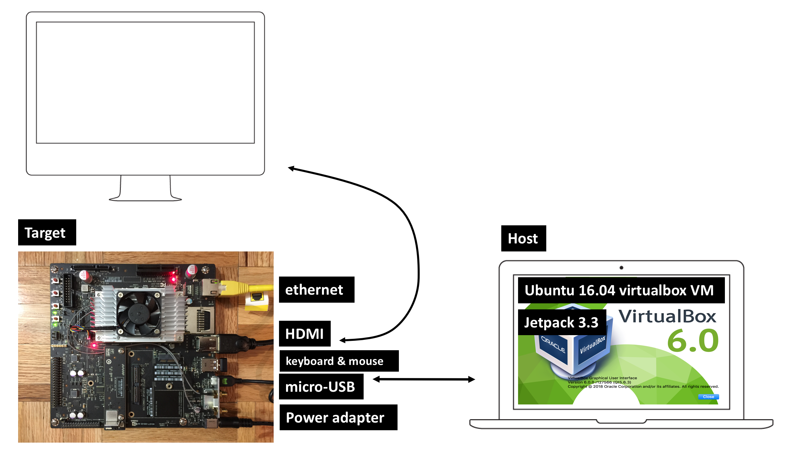

# Step by Step guide to setup NVIDIA Jetson TX2 

This is a step by step guide to set up Nvidia Jetson TX2 with a virtualbox VM in your local machine. There are a couple of things that are required from your side as well. 

### Jetson TX2 box 

- GPU Board
- micro-USB cable 

These two are required to setup. 

### Your side

- wireless keyboard (to connect to Jetson box)
- wireless mouse (to connect to Jetson box)  
You can buy wireless keyboard and mouse combo. I bought <a href="https://www.amazon.com/gp/product/B079JLY5M5/ref=oh_aui_detailpage_o00_s00?ie=UTF8&psc=1" target="_blank">this one</a> from Amazon. 
- Monitor (for HDMI display from Jetson box)
- Ethernet cable (to connect Jetson box to the same router that your local laptop connects to) 

## Background

There are a few things that you need to be familiar with. 

1. Host (Physical device: Ubuntu 16.04) 
2. Target (Physical device: Jetson TX2 GPU processor) 
3. Jetpack (installer software) 

The target Jetson TX2 has no OS installed. So we're going to install Ubuntu 16.04 in Jetson TX2 via Host. 

Figure. Jetson TX2 and local Host setup

## Installation 

**Host**  
The host that will flash OS (see below) to Jetson box. In older version of Nvidia TX1, I saw people tested with Ubuntu 14.0. But for TX2, I only tested with Ubuntu 16.04 and it works fine. Host OS is Ubuntu that will download Jetpack (see below) and do all the installation to Jetson TX2. I'm interchangeably using the word Jetson box and Jetson TX2. They're all the same. It's credit size GPU motherboard with all essential ports for ethernet, USB, wi-fi, memory, etc. 

If you already have a local machine or laptop that have Ubuntu, you don't need to go an extra mile setting up the virtual box. If you don't have one like me, you might want to install virtualbox 6.0 in your local laptop instead of buying a new laptop with Ubuntu OS.  

- Download virtualbox and virtual box extension pack (all supported platform) <a href="https://www.virtualbox.org/wiki/Downloads">Here</a>. 
- Install virtualbox 
- Go to Virtualbox --> Preferences... --> Extensions --> Add "New package" button 

Note
Double clicking extension pack will just open the virtualbox but won't install automatically.  

**Virtualbox**  

- click "New" 
- Name = <Your_Choice>
- Type = Linux  
- Version = Ubuntu 64 
- Memory = 1024 
- VDI (Virtualbox Disk Image) 
- Dynamically allocated 
- File allocation and size = 50 GB (You'd need at least 10 GB minimum) 

Once the VM is created, 

- select your created VM 
- go to VirtualBox Settings 
- `System` --> `Processors` --> 2CPU 
- `Network` --> `Enabled Network Adapter` --> Attached to `Bridged Adapter` 
- `Port` --> `USB` --> `Enabled USB Controller` --> `USB 3.0 (xHCI) Controller 

## Host Launch 

- click **Start** 

